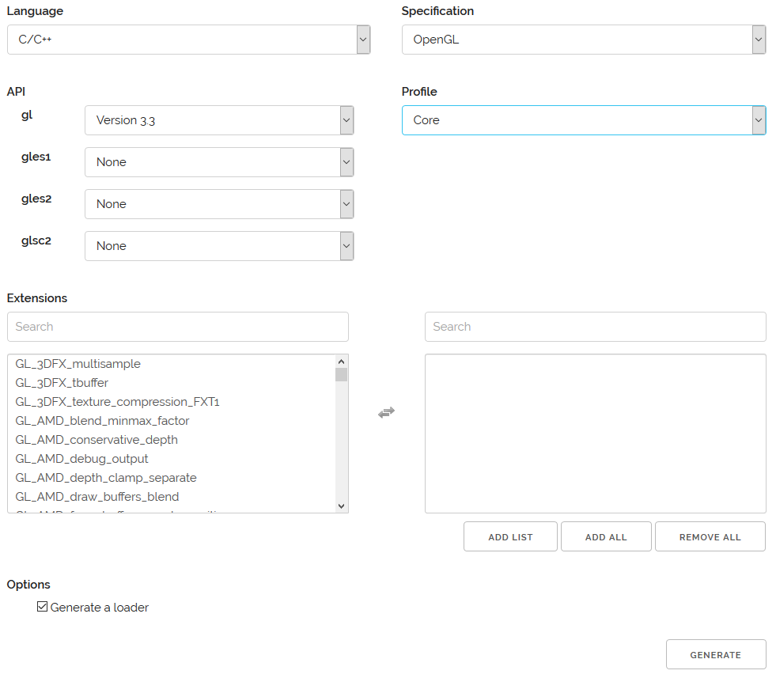

# OpenGL/CMake Configuration on Windows

This guide was written and tested with Windows 10 Pro 64-bit, but this guide is
likely to work on other Versions of windows as well. In fact, there is nothing
in this guide that is windows specific. This guide should work on *nix systems
as well.

## Initial Setup

This guide assumes a working setup of CMake is present on the system. Our
starting CMake file will look like the following:

```cmake
cmake_minimum_required(VERSION 2.8)
project(your_project)

add_executable(your_project main.cpp)
```

`your_project` can be anything you want, as long as you are consistent.
The contents of main.cpp are not important for this guide.

## GLFW Installation

The first tool that will need to be installed is GLFW. This is a small cross
platform library that handles all of the operating specific calls needed
to create a working OpenGL context (the window where things will be drawn).

Linux has (relatively) simple tools to get GLFW working with CMake. For windows,
things are a bit more involved. A lot of the same info provided in this section
can also be found in GLFW's documentation 
[here](http://www.glfw.org/docs/3.0/build.html#build_link_cmake_source).

### Adding the Submodule

We are going to clone the GLFW source as a 
[git submodule](https://git-scm.com/book/en/v2/Git-Tools-Submodules). It is 
a good idea to familiarize yourself with git submodules. In a nutshell, you
are taking another git repository and embedding it into your own git repository.

GLFW's source repository can be found on github [here](https://github.com/glfw/glfw).
Because we're going to be importing all of GLFW's source files, we will want to
keep it in its own directory. We will create a folder called `lib` in the project's
root folder (the same level as CMakeLists.txt). This folder can be called anything
you want, but a folder called `lib` is an intuitive place to store the libraries
your project depends on.

Once inside the `lib` folder, we will use add the GLFW library as a git submodule.
The command to do that is:
`git submodule add https://github.com/glfw/glfw.git`. Make sure you are in the
lib folder when you execute this command! Adding a submodule will make some
changes to your repository. Be sure to commit those changes.

**Notice**: Once your git repository contains submodules, `git clone ...` will
not do what you expect. It will clone your repository, but it will not clone
the submodules. You will need to add `--recurse-submodules` flag to your
git clone command. So, it will look like `git clone --recurse-submodules ...`.

If you forgot the `--recurse-submodules` flag, you can always pull your 
submodules later with the `git submodule init` and `git submodule update`
commands.

### CMake Configuration

There are three lines to add to our CMake file. The first one:

```cmake
add_subdirectory(lib/glfw)
```

Conveniently, GLFW is also built using CMake. This means that GLFW also has a
CMakeLists.txt. When the 
[add_subdirectory](https://cmake.org/cmake/help/v3.10/command/add_subdirectory.html) 
CMake command is used, CMake will look in the given subdirectory for that project's
CMakeLists.txt. From there CMake configures everything needed to get that project
building alongside your project.

Next, we will need to tell CMake where to find GLFW's header files:

```cmake
include_directories(lib/glfw/include)
```

Finally, after the `add_executable` command, we must link our code with GLFW's
library:

```cmake
target_link_libraries(your_project glfw ${GLFW_LIBRARIES})
```

The first parameter is the name of our executable. All of the parameters after
that are libraries to link to our final executable. "glfw" comes from line 85
(as of glfw commit 973bf296) of glfw/src/CMakeLists.txt. GLFW is relatively
complex, consisting of multiple CMakeLists.txt itself (for building samples,
the core library, etc). The top level CMakeLists.txt found in the `glfw`
folder manages all this for you, which is why `add_subdirectory` only
needs to point to lib/glfw, and not any of GLFW's subfolders.

GLFW's line 85:

```cmake
add_library(glfw ${glfw_SOURCES} ${glfw_HEADERS})
```

GLFW uses `add_library` instead of `add_executable` so it creates a .lib
(or .dll) instead of a .exe. Because GLFW's first argument in
`add_library` was "glfw", "glfw" is the argument we use in
`target_link_libraries`. 

GLFW also has dependencies. Somewhere in GLFW's CMakeLists.txt, the variable
`${GLFW_LIBRARIES}` was defined and made available for us to use. We must
also link to the libraries GLFW depends on. This is why the third argument
of `target_link_libraries` is `${GLFW_LIBRARIES}`.

Our CMakeLists.txt will now look like the following:

```cmake
cmake_minimum_required(VERSION 2.8)
project(your_project)

add_subdirectory(lib/glfw)

include_directories(lib/glfw/include)

add_executable(your_project main.cpp)
target_link_libraries(your_project glfw ${GLFW_LIBRARIES})
```

## GLAD Installation

GLAD is a library that maps OpenGL functions so that they are useable from
our C++ program. A good explanation of what GLAD does can be found
[here](https://open.gl/context#Onemorething). While this website uses
GLEW, GLEW and GLAD do the same thing. GLAD is a bit more modern and
easier to work with. GLAD is also used by 
[LoGL](https://learnopengl.com/Getting-started/Creating-a-window), 
and they have a good explanation on their website as well.

These extension mapping libraries need to be generated according to your
use case. Generating GLAD is extremely simple. They have a web interface:

http://glad.dav1d.de/

All we need is the core OpenGL profile and set the OpenGL version to 3.3.
LoGL reccomends version 3.3. If we needed more advanced features intorduced in
later versions of OpenGL, we would need to target a higher version of OpenGL.
Once the version and the profile is selected, the `GENERATE` button at the 
bottom can be clicked.



You will be taken to a page with the generated source files. You will want
to download `glad.zip`. These files will be integrated directly into your
project. The source files generated by GLAD are public domain, so there's
no troubles with licensing or anything like that.

We will put the GLAD files in the lib folder. This time we manually create
a `glad` folder. Inside that folder we can paste all of the contents found
in `glad.zip`. CMake will now need to be told where to find these files.

```cmake
include_directories(lib/glad/include)
```

This tells the compiler where to find the GLAD headers. GLAD only has one
source file, which will be added as an argument to the `add_executable`
command. Thus, that line in our CMakeLists.txt will look like:

```cmake
add_executable(your_project main.cpp lib/glad/src/glad.c)
```

Our final CMakeLists.txt file looks like:

```cmake
cmake_minimum_required(VERSION 2.8)
project(your_project)

add_subdirectory(lib/glfw)

include_directories(lib/glfw/include)
include_directories(lib/glad/include)

add_executable(your_project main.cpp lib/glad/src/glad.c)
target_link_libraries(your_project glfw ${GLFW_LIBRARIES})
```

From here, our project is now ready for OpenGL!
